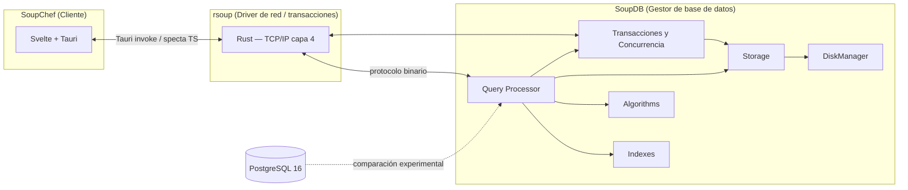

# SoupDB

[](https://github.com/BD2-Project/SoupBD/actions/workflows/ci.yml)
[](https://github.com/BD2-Project/SoupBD/actions/workflows/ci.yml)
[]()
[](LICENSE)
[]()

Motor de base de datos **multimodal** (relacional, espacial y vectorial) construido desde cero en Python, con integración de IA. La aplicación final es un **RAG sobre documentos académicos**: indexa, recupera y genera respuestas sobre el contenido de papers, informes y otros materiales académicos.

## IA aplicada

- **RAG** (retrieval-augmented generation) sobre documentos académicos.
- **Búsqueda vectorial** (embeddings, HNSW) para similitud semántica.
- **Recuperación léxica** (BM25) y fusión con la búsqueda vectorial.
- **Extracción de características multimodales** (SIFT, MFCC, K-Means).

<p align="center"><sub>Proyecto académico · UTEC · Base de Datos 2 · ciclo 2026-2</sub></p>

## Arquitectura



Trabajo **multirepo**: `SoupDB` (gestor de base de datos), desarrollado en este repositorio; `rsoup` (driver de red y control de transacciones y concurrencia, en [BD2-Project/rsoup](https://github.com/BD2-Project/rsoup) — [documentación](https://github.com/BD2-Project/rsoup/tree/main/docs)); `SoupChef` (cliente de escritorio del gestor). El desarrollo se coordina mediante contexto compartido de arquitectura, reglas y convenciones que aplican a todos los equipos y a los agentes de IA.

El **driver `rsoup`** es el cliente Rust que los consumidores usan para conectarse al pool del gestor (TCP/IP, protocolo binario v1, puerto `DRIVER_PORT`); el frontend SoupChef lo integra vía Tauri. Ver [docs/driver.md](docs/driver.md) y el protocolo en [docs/protocolo.md](docs/protocolo.md).

## Dependencias

| Dependencia | Uso | Instalación |
|---|---|---|
| Python ≥ 3.11 | Motor de base de datos | python.org o gestor del SO |
| uv | Gestor de paquetes y entornos | `curl -LsSf https://astral.sh/uv/install.sh \| sh` |
| Docker | Contenedor y despliegue local | Docker Desktop o gestor del SO |
| PostgreSQL 16 | Comparación experimental | `docker compose up postgres` o gestor del SO |
| typst | Informe técnico (`paper/`) | gestor del SO |

## Setup

```bash
# Instalar dependencias y crear el entorno
uv sync --all-groups

# Tests y lint
uv run pytest
uv run ruff check .

# Documentación (build local)
uv run --group docs mkdocs build

# Informe técnico
typst compile paper/main.typ paper/soupdb.pdf

# Despliegue local (gestor + postgres)
docker compose up
```

## Gestión de paquete y contenedor

- **Paquete:** el motor se gestiona con **uv** (`pyproject.toml` + `uv.lock` versionado). El wheel se construye con `uv build` y se adjunta a cada release. El runtime no tiene dependencias externas (solo stdlib).
- **Contenedor:** `Dockerfile` multi-stage (build con uv sobre imagen slim) + `docker-compose.yml` con los servicios `engine`, `postgres:16` y `web` (placeholder `SoupChef`). La imagen del engine se publica en **GHCR** (`ghcr.io/BD2-Project/soupdb`) al crear un tag de versión.

## Documentación

- API reference y guías: https://BD2-Project.github.io/SoupBD
- Informe técnico (typst): se publica como **PDF** en las [Releases](https://github.com/BD2-Project/SoupBD/releases).
- Estrategia de versionado de releases: `docs/estrategia-release.md`.

## Licencia

MIT — ver [LICENSE](LICENSE).